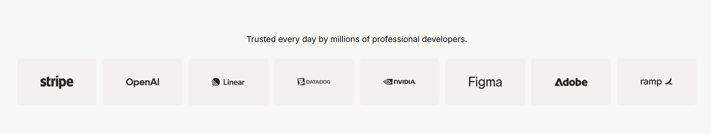
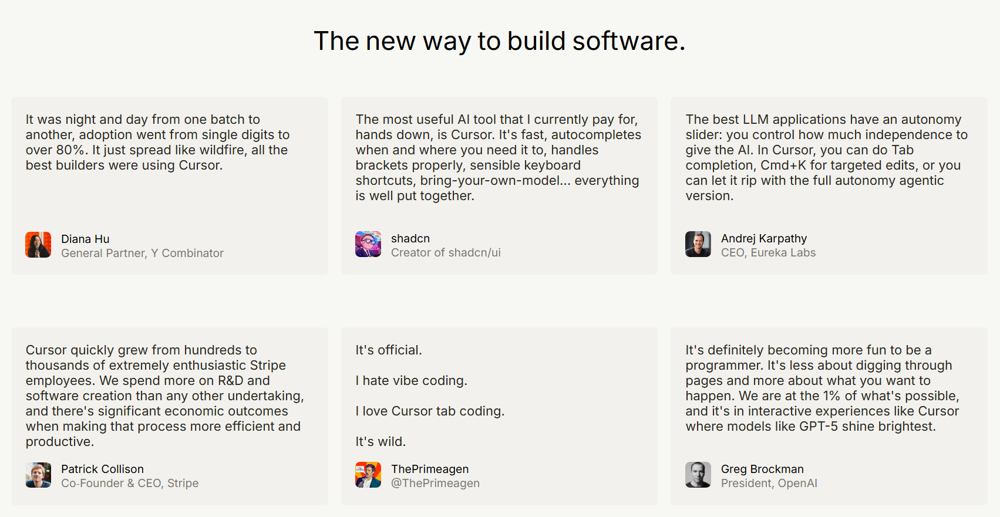
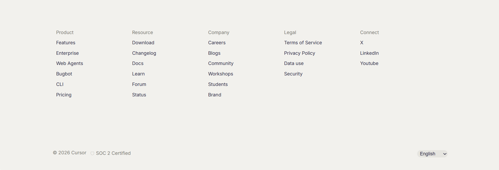

# Cursor Landing Page Clone

Desktop-first clone of the Cursor developer tool landing page built using only HTML and CSS.

## Live Demo

https://imayushsawant.github.io/Cursor-clone/

## Tech Stack
- HTML5
- CSS3

## Sections Implemented

- Top Navigation Bar
- Hero Section
- Trusted By / Logos
- Feature Sections (3 blocks)
- Testimonials Grid
- Feature Cards Section
- Use Cases / Stories
- Footer

##  Fonts & Colors

### Fonts
- Inter (400, 500, 600)

### Colors
- Background: #F7F7F4  
- Card Background: #F2F1ED  
- Primary Text: #26251E  
- Secondary Text: #787771  
- Accent Orange: #f54e00  
- Dark Button: #26251E  

##  Screenshots

### Navigation Bar & Hero Section

### Trusted By Section

### Testimonials

### Footer

## Notes
- No JavaScript
- No TailwindCSS
- No animations or fancy effects
- Desktop-first layout 
- Built using semantic HTML and custom CSS
- Images and layout inspired by Cursor official website
